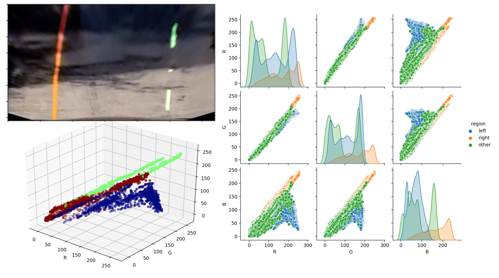

# Advanced Lane Finding Project

## Goals/steps

The goals / steps of this project are the following:

* Compute the camera calibration matrix and distortion coefficients given a set of chessboard images.
* Apply a distortion correction to raw images.
* Apply a perspective transform to rectify images ("birds-eye view". Here I put this step before next step because I believe that applying perspective transform first so vertical lanes are vertical in images and then apply gradient in x direction can provide an effective method for lane detection).
* Use color transforms, gradients, etc., to create a thresholded binary image.
* Detect lane pixels and fit to find the lane boundary.
* Determine the curvature of the lane and vehicle position with respect to center.
* Warp the detected lane boundaries back onto the original image.
* Output visual display of the lane boundaries and numerical estimation of lane curvature and vehicle position.

## Folder structure
* `scripts/` folder contains all the Python codes. 
    * Please go to this folder first before you run each script:

            cd scripts/

    * `lanefindlib.py` is the centralized "library" script that contains all the important functions, and tuned parameters.
    * Most other scripts in this folder calls functions in `lanefindlib.py` to produce results for test images and the final video (See details in the section for each step).

## Camera Calibration

The code for this step is in `scripts/camera_calibration.py` which calls the function `calibrateCameraFromChessboardImages` defined in lines 35 through 78 of `scripts/lanefindlib.py`. 

Run the commands below to see the results, and save the output in a pickle file `camera_data.p` in `scripts/` folder: 

```
cd scripts/
./camera_calibration.py '../camera_cal/calibration*.jpg' camera_data.p ../camera_cal/calibration5.jpg ../output_images/calibration5_undistort_savefig.png
```

I start by preparing "object points", which will be the (x, y, z) coordinates of the chessboard corners in the world. Here I am assuming the chessboard is fixed on the (x, y) plane at z=0, such that the object points are the same for each calibration image.  Thus, `objp` is just a replicated array of coordinates, and `objpoints` will be appended with a copy of it every time I successfully detect all chessboard corners in a test image.  `imgpoints` will be appended with the (x, y) pixel position of each of the corners in the image plane with each successful chessboard detection.  

I looked through the images in the folder `camera_cal` and found most images have 9x6 inner corners. The ones that have field of view cropped and thus missed inner corners will fail at `findChessboardCorners` function and not contribute to the results. These images turned out to be `calibration1.jpg`, `calibration4.jpg`, and `calibration5.jpg`, as monitored by my code of printing Failure when `ret` of the findChessboardCorners is not True.

I then used the output `objpoints` and `imgpoints` to compute the camera calibration and distortion coefficients using the `cv2.calibrateCamera()` function.  I applied this distortion correction to the test image (selected to be `calibration5.jpg`) using the `cv2.undistort()` function and obtained this result: 


## Pipeline (single images)

### 1. Distortion correction
The camera matrix and distortion coefficients from previous camera calibration are saved in a pickle file `camera_data.p`. I loaded these results and run on this image `test_images/test1.jpg`. I ran the commands/codes below: 

```
cd scripts/
./undistort.py camera_data.p ../test_images/test1.jpg ../output_images/test1_savefig_undistort.png
```

The result is shown below. While there is not long straight line off-center so we can a quick santity check of the undistortion, the white car near the corner does show the effect of correction of barrel distortion -- after correction, the car is less squeezed towards the center.  


### 2. Perspective transform
I put this step ahead of color/gradient thresholding, because for this particular application of finding lane, as the lane in top-down view is near along y direction, so gradient in x direction for the top-down view should work well. 

I ran the following commands for this step: 

```
cd scripts/
./perspective_transform.py camera_data.p ../output_images/perspective_transform_savefig.png
```

I first picked one image with left and right lanes both straight `test_images/straight_lines1.jpg`, and do undistortion. 

Then in Keynote, on this undistorted image, I draw a similar trapzoid that correpsonds to a top-down view of a 3.7m x 30 m rectange (same choice as shown in the lectures), and then read the coordinates using upper-left corner as origin. 


The perspective warping is made such that these 4 corners will be mapped to then center half vertical stripe:

```python
dst_perspective = np.float32(
    [[(img_size[0] / 4), 0],
    [(img_size[0] / 4), img_size[1]],
    [(img_size[0] * 3 / 4), img_size[1]],
    [(img_size[0] * 3 / 4), 0]]);
```

I found that I need to fine tune the coordinates a little bit, so that both images with straight lines as blow after the transform becomes vertical. This resulted in the following source and destination points (coded in line 18 to 28 in `lanefindlib.py`:

| Source        | Destination   | 
|:-------------:|:-------------:| 
| 573, 466      | 320, 0        | 
| 213, 720      | 320, 720      |
| 1105, 720     | 960, 720      |
| 713, 466      | 960, 0        |

I can then run `getPerspectiveTransform` using these 4 pairs of points (line 50), and then apply the solved transform matrix on the undistorted image (line 54). 

I verified that my perspective transform was working as expected by using polylines to draw the `src_perspective` and `dst_perspective` points onto a test image and its warped counterpart to verify that the lines appear parallel in the warped image.


### 3. Color/gradients thresholdeding for lane detection
This is the part I ended up spending most time on. I tried different approches. What ended up working well is my final apporach based on  (S | dxR) & R
`(S | dxR) & R` here means S channel (in HLS space) OR Sobel in x direction of the R channel, then AND R channel to filter out false detections. 

As explained before, I believe for the particular application of lane detection, since in top-down view the lanes will be close to vertical, it should be an effective approach to first perform perspective transform and then perform thresholding based on gradient in x direction.

So I first perform distortion correction and unwarping, based on the steps before, for all images in the `test_images/` folder: 


    ls ../test_images/*.jpg | while read -r jpg; do 
        jpg_out=$(echo $jpg | sed -e 's/test_images/output_images/' -e 's/.jpg/_undistort_warp.jpg/')
        echo ./undistort_warp.py $jpg "$jpg_out"  camera_data.p
        ./undistort_warp.py $jpg "$jpg_out"  camera_data.p
    done

The result is as following: 


I started with the intuition that the lanes are either yellow or white, so I thought get a reference yellow and white color and do color difference from those two reference colors might be a good way to identify the lanes. However, on a challenging image like `test5`, it turned out that the separation is very difficult. Here I manually created the mask of left lane, right lane, and other region, and observe the separation of pixels in RGB 3d color spaces as well as 2d planes -- the separation is difficult: 



Next I examine all possible single channels, including gray, R, G, B (in RGB); H, L, S (in HLS); and H, S, V (in HSV color space). I chose two representative images, `test1.jpg` (bright) and `test5.jpg` (shaded):


As shown above, S channel in HLS does a good job for most of the time; however in `test5.jpg` when there is shade, it misses the white lane; also it misses several white short sections. Then I look for alternative channels as a complementary alternative. I found either "R" or "V" can be good options. I used "R" and it turned out working well.  Then I perform color and gradient thresholding, using `(S | dxR) & R` (S OR Sobel x for R, then AND R to filter out false detections/cleaning up). Please see line 109 to line 145 in `scripts/lanefindlib.py` for details:

    ./threshold_color_gradient.py '../output_images/test*_undistort_warp.jpg' ../output_images/test_undistort_warp_threshold_color_gradient.jpg 

. The result is shown here: 


Explanations of each row in the figure above: 

* Row "S" shows S channel in HLS color space. It usually does a good job except when the road is in a shade or for the short white sections; 
* Row "S_mask" shows mask by thresholding the S channel.
* Row "R" shows the red channel.
* Row "R_mask" shows mask by thresholding the R channel.
* Row "Rsobelx" shows the x gradient of red channel.
* Row "Rsobelx_mask" shows mask by thresholding the x gradient of red channel.
* Row "SR_mask" shows the combined mask with logical OR AND combination: `(S | dxR) & R`.

We see in the final row the lane pixels were successfully picked up with little some false detections, which will further be filtered out by a window around polynomial fit, and also limiting the range of lane to be 10% to 90% of the horizontal field of view.

### 4. Identify lane-line pixels and polynomial fit

For this step (together with previous steps), I run these commands:

```
cd scripts
./find_lane_fit_refine.py '../output_images/test*_undistort_warp_mask.jpg' ../output_images/test_undistort_warp_mask_find_lane_fit_refine.jpg
```

The function that the above wrapper executable calls is defined in line 283 to line 373 in `scripts/lanefindlib.py`. You will see there are two versions of finding lane pixels: 1) finding from scratch, using 'search_by_histogram_peak_sliding_window()' function; 2) finding with initial estimations of fit coefficients, which can be from smoothed fit coeffients from a rolling window based on previous frames, using `search_around_previous_fit()` function. 

For finding from scratch with `search_by_histogram_peak_sliding_window()` defined in line 146 to line 261 in `lanefindlib.py`, the steps included are: 

1. After undistorting, perspective transform, and thresholding, I count the pixels in each column, and then find left and right peaks of this histogram  to identify inital guesses of lane positions and set a window with defined margin values. 
2. Then I used the sliding window around the histogram peaks to find vertically where the lane is in each section window. The window of each stripe at different y steps starts with previous estimated position and a given margin as window width, then gets recentered by the average position of included pixels. 
3. I fit my lane lines with a 2nd order polynomial, as shown in the last figure.

For finding with previous fit results as initial esitmates, I replace the search window based on histogram peaks above with windows around the fit lines. 
To make this method more robust when left or right lane pixels are poorly filtered out in the thresholded mask, I added a step where I detect the top and bottom width of the lanes. When they differ too much (as a weaker criteria than being not parallel), I would trust the better detected lane (the figure of merit is number of pixels and how far they extend, quantified by sum of squared distance from mean), and only fit the 3rd coefficient of the other lane while copying the first two coefficents from the better detected lane.

The output images for these steps are shown in this figure:


We see that except `test5`, all other test images show right results. We will see later how we use temporal behavior to detect an anomaly frame like `test5` and use previous estimates to replace the results. 

### 5. Calculate radius of curvature of the lane and the position of the vehicle with respect to center

I used the analytical formula of radius of curvature, and modify this formula so it gives the output value with unit of meter with input value of pixel, as shown in line 419 in `lanefindlib.py`:

    rcurv_left = (1.0 + (2.0*Am_left*ym_eval + Bm_left)**2)**1.5/2.0/np.abs(Am_left); 
    
Here the pixel step size in meter is determined in the step where we define `dst_perspective` for `src_perspective`, and some estimations of lane width and length (line 31 to 32 in `lanefindlib.py`): 

    dy_m = 30.0/img_size[1]; # 720 # meters per pixel in y dimension
    dx_m = 3.7/(0.5*img_size[0]);# lane width: 3.7m. taking up half image width # 700 # meters per pixel in x dimension

The offset between the car and the center of the road is computed in line 438 in `lanefindlib.py`: 

    xoffset = dx_m*(xCarWarped - xLaneCen);

, where `xCarWarped` is the position of the car. Assume that the camera is mounted at the x-center of the car, then in the unwarped/original image, the car would be at the x-center (and also bottom of the FoV as chosen) of the image. We can find out in the warped image, the position would be (in line 60 of `perspective_transform.py`): 

    xyCarWarped = lanefindlib.perspectiveTransformMap(perspectiveTransform, xyCar);

, where `perspectiveTransformMap` is a function that finds the corresponding corodinates of points with a given perspective transform or its inverse transform: 

.

Then the reference position of center of lane is computed in line 392 of `lanefindlib.py`:

    xLaneCen = 0.5*(left_fitx[-1] + right_fitx[-1]);

, where `left_fitx, right_fitx` are the positions of left and right lanes, and we use index `[-1]` to get the positions at the bottom. 

### 6. Annotate lanes in the unwarped image

I can create the labelling elements(left and right lane pixels, and the lane area in between) in the warped/top-down space first; then use the inverse matrix of the perspective transform `np.linalg.inv(perspectiveTransform)` to map it back to the original image space, and overlay it on top of original image. I then annotate the computed values of radius of curvature and offset. These are included in the same script `process_image_with_parameters.py`, and to see an example, I run  

```
cd scripts
./process_image_with_parameters.py ../test_images/test3.jpg ../output_images/test3 camera_data.p
``` 

I implemented this step in lines 87 through 96 in my code in `scripts/process_image_with_parameters.py`.  Here is an example of my result on a test image:


### 7. Test on other test images

I added this step. While the pipeline runs well on `test3.jpg`, I would like to see how it performs on other images in the `test_images` folder. To run `process_image_with_parameters.py` in the `scripts` folder, I used the following bash commands: 

``` bash
ls ../test_images/*.jpg | while read -r jpg; do 
    basename_jpg=$(basename $jpg .jpg)
    echo ./process_image_with_parameters.py $jpg ../output_images/$basename_jpg camera_data.p
    ./process_image_with_parameters.py $jpg ../output_images/$basename_jpg camera_data.p 0
done
``` 

The results are shown below. For the final parameters used here, `test1` doesn't work well. At one point of tuning the parameters, I can make all test images work; however, later, to make all the frames of the video work, I changed the parameters, and rely on temporal behavior to make other frames like `test1` work. 


---

## Pipeline (video)

Here's a [link to my video result](./project_video_output.mp4)

I ended up labelling the frame number of each frame as you see in the text annotationsof each frame, so whenver there is a failure I can get that frame out, add to my "test" images set, and retune the pipeline. 

---

## Discussion

### 1. Briefly discuss any problems / issues you faced in your implementation of this project.  Where will your pipeline likely fail?  What could you do to make it more robust?

**Problems/issues**: Mostly it is about find a good input mask for lane pixels: how to find the right thresholding method that keeps the lane pixels without too many false detected pixels that leads to wrong result of polynomial fitting. Since the white dashed lines sometimes have fewer pixels in the frame, we do want to be preserve all those pixels by setting lower threshold which leads to false positives. 

**My approach/techniques** To make it work, three things turned out to help: 

1. I ended up playing a lot on which channel to do threshold on, how to effectively combine different color thresholding and gradient thresholding using different combinations of "AND" "OR" and its orders. 
2. The polynomial fit itself turns out to be a good cleaning step to get rid of some false detections (so we have some tolerance about false positives).
3. When there are still problems, I rely on using temporal behavior as prior knowledge to further remove failure cases -- smoothing, detection of whether current frame is anomaly and replay with best guess from a rolling average. 

**Where will it likely fail**: My apporach worked pretty well on `project_video.mp4`, however, failed for `challenge_video.mp4` and `harder_challenge_video.mp4`. When there are wet traces, shades from traces, etc., the thresholding method can have a difficult time detecting lane pixels correctly. 

**Further improvements** I would think more tuning of the thresholding and how to use neighbor frames better can help -- but indeed when tuning the pipeline, I turned out to use something like the machine learning apporach -- whenver I found a failure frame in the video, I extract that frame out, get the root cause of the failure, and manually tune the parameters so that this frame and all previous frame all pass (training & active learning). I can do a better job on the two more challenging videos by first 1) extract the failure frame and identify the root causes; 2) add them to my "test images" and retune the thresholding methods so the input mask for lane detection are good; 3) if thresholding itself doesn't solve the problem, I will have to make use of the temporal behavior by reuse the previous successful frames before failure frames. 
